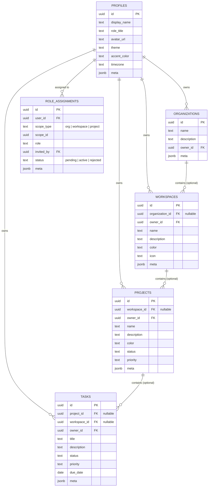

# 🌌 MyOS Hybrid Relational-JSONB Database System Blueprint

This document specifies the complete, enterprise-grade database system architecture custom-engineered for **MyOS**. It implements a **Hybrid-Relational Architecture** supporting a dynamic collaboration hierarchy:
`Organization ➔ Workspace ➔ Project ➔ Task`

---

## 🗺️ 1. Entity Relationship Diagram (ERD)

The relational and structural layout of MyOS is mapped below. Standalone items can exist independently at any level (e.g., standalone tasks, projects, or workspaces), while grouped entities respect standard cascaded relationships.



---

## 🏛️ 2. Architectural Blueprint: Dual-Engine Mapping

MyOS runs on a **Dual-Engine Architectural Model** supporting both strict SQL relational environments and dynamic schemaless environments. 

### A. The Schemaless Document Store (JSONB Matrix)
For maximum speed and serverless portability (e.g., client-side offline caches or Supabase fast mock proxy filters), all assets can be fully represented as serialized documents under a global unified `items` table.
* The application layers map dynamic fields within the `data` column using a predefined structural mapping:

| Entity Type | Required JSON Fields | Relational Association |
| :--- | :--- | :--- |
| **`user`** | `username`, `password_hash`, `display_name`, `role_title`, `avatar_url` | Maps to `profiles` relational record |
| **`organization`** | `name`, `description`, `user_id` | `user_id` designates the Organization Owner |
| **`workspace`** | `name`, `description`, `color`, `icon`, `user_id`, `organization_id` | `organization_id` is optional (standalone workspace) |
| **`project`** | `name`, `description`, `color`, `status`, `priority`, `user_id`, `workspace_id` | `workspace_id` is optional (standalone project) |
| **`task`** | `title`, `description`, `status`, `priority`, `due_date`, `user_id`, `project_id`, `workspace_id` | `project_id` & `workspace_id` are optional (standalone task) |
| **`role_assignment`** | `user_id`, `scope_type`, `scope_id`, `role`, `status` | Configures dynamic RBAC access control permissions |

### B. Relational SQL Mode
For strict transactional environments, analytical views, and cross-table joins, the database maps these documents directly to optimized physical SQL tables.

---

## 💻 3. Complete DDL Script (`database.sql`)

> [!IMPORTANT]
> **COMPATIBILITY NOTICE**
> The SQL script below is 100% compatible with PostgreSQL 15+ and is tailored specifically for **Supabase**. You can copy it, paste it directly into your **Supabase SQL Editor**, and click **Run** to execute.

> [!CAUTION]
> **PRESERVE EXISTING DATA & USER CREDENTIALS**
> If you have already registered users, created workspaces, or added tasks in your live MyOS application, the unified records are stored in the **`items`** table.
> * **Clean Install / Re-install**: Run the script below as-is to wipe all tables and start completely fresh.
> * **Preserve Live Data**: If you want to keep your existing live application data, **remove `items`** from the `DROP TABLE IF EXISTS` command on line 35 and **delete Section 2-L (`CREATE TABLE items ...`)** from this script before running.

```sql
-- =========================================================================
-- 1. BASE CONFIGURATION & EXTENSIONS
-- =========================================================================
CREATE EXTENSION IF NOT EXISTS "uuid-ossp";
CREATE EXTENSION IF NOT EXISTS pgcrypto;

-- Cleanup existing schema safely to allow fresh install
DROP TABLE IF EXISTS profiles, organizations, workspaces, projects, tasks, notes, finance_ledger, files, tool_registry, dynamic_attributes, role_assignments, items CASCADE;

-- =========================================================================
-- 2. CORE SCHEMAS & COLLABORATION TABLES
-- =========================================================================

-- A. Profiles (User Identity and Preferences)
CREATE TABLE profiles (
  id UUID PRIMARY KEY DEFAULT gen_random_uuid(),
  username TEXT UNIQUE,
  email TEXT UNIQUE,
  dob DATE,
  password_hash TEXT,
  display_name TEXT NOT NULL DEFAULT 'Core Protocol User',
  role_title TEXT NOT NULL DEFAULT 'Member',
  avatar_url TEXT DEFAULT 'https://api.dicebear.com/7.x/bottts/svg?seed=MyOS',
  theme TEXT NOT NULL DEFAULT 'dark' CHECK (theme IN ('light', 'dark', 'system')),
  accent_color TEXT NOT NULL DEFAULT '#3b82f6',
  timezone TEXT NOT NULL DEFAULT 'Asia/Phnom_Penh',
  date_format TEXT NOT NULL DEFAULT 'DD/MM/YYYY',
  notifications_enabled BOOLEAN NOT NULL DEFAULT TRUE,
  gemini_api_key TEXT,
  meta JSONB NOT NULL DEFAULT '{}'::jsonb, -- Infinite extensible configuration parameters
  created_at TIMESTAMPTZ NOT NULL DEFAULT NOW(),
  updated_at TIMESTAMPTZ NOT NULL DEFAULT NOW()
);

-- B. Organizations (Logical Multi-Tenant Enterprise Boundary)
CREATE TABLE organizations (
  id UUID PRIMARY KEY DEFAULT gen_random_uuid(),
  name TEXT NOT NULL,
  description TEXT,
  owner_id UUID NOT NULL REFERENCES profiles(id) ON DELETE CASCADE,
  meta JSONB NOT NULL DEFAULT '{}'::jsonb,
  created_at TIMESTAMPTZ NOT NULL DEFAULT NOW(),
  updated_at TIMESTAMPTZ NOT NULL DEFAULT NOW()
);

-- C. Workspaces (Sub-divisions under Organizations or Standalone)
CREATE TABLE workspaces (
  id UUID PRIMARY KEY DEFAULT gen_random_uuid(),
  organization_id UUID REFERENCES organizations(id) ON DELETE SET NULL, -- Null if standalone workspace
  owner_id UUID NOT NULL REFERENCES profiles(id) ON DELETE CASCADE,
  name TEXT NOT NULL,
  description TEXT,
  color TEXT DEFAULT '#3b82f6',
  icon TEXT DEFAULT 'Briefcase',
  logo TEXT,
  status TEXT NOT NULL DEFAULT 'active' CHECK (status IN ('active', 'archived', 'paused')),
  meta JSONB NOT NULL DEFAULT '{}'::jsonb,
  created_at TIMESTAMPTZ NOT NULL DEFAULT NOW(),
  updated_at TIMESTAMPTZ NOT NULL DEFAULT NOW()
);

-- D. Projects (Structured Deliverables under Workspaces or Standalone)
CREATE TABLE projects (
  id UUID PRIMARY KEY DEFAULT gen_random_uuid(),
  workspace_id UUID REFERENCES workspaces(id) ON DELETE SET NULL, -- Null if standalone project
  owner_id UUID NOT NULL REFERENCES profiles(id) ON DELETE CASCADE,
  name TEXT NOT NULL,
  description TEXT,
  color TEXT DEFAULT '#3b82f6',
  status TEXT NOT NULL DEFAULT 'active' CHECK (status IN ('planning', 'active', 'on-hold', 'completed', 'cancelled')),
  priority TEXT NOT NULL DEFAULT 'medium' CHECK (priority IN ('low', 'medium', 'high', 'critical')),
  start_date DATE,
  end_date DATE,
  category TEXT DEFAULT 'General',
  meta JSONB NOT NULL DEFAULT '{}'::jsonb,
  created_at TIMESTAMPTZ NOT NULL DEFAULT NOW(),
  updated_at TIMESTAMPTZ NOT NULL DEFAULT NOW()
);

-- E. Tasks (Core Operations - Project-Linked, Workspace-Linked, or Standalone)
CREATE TABLE tasks (
  id UUID PRIMARY KEY DEFAULT gen_random_uuid(),
  project_id UUID REFERENCES projects(id) ON DELETE SET NULL, -- Null if standalone task
  workspace_id UUID REFERENCES workspaces(id) ON DELETE SET NULL, -- Standalone or project-linked task
  owner_id UUID NOT NULL REFERENCES profiles(id) ON DELETE CASCADE,
  title TEXT NOT NULL,
  description TEXT,
  status TEXT NOT NULL DEFAULT 'pending' CHECK (status IN ('pending', 'in-progress', 'review', 'completed', 'archived')),
  priority TEXT NOT NULL DEFAULT 'medium' CHECK (priority IN ('low', 'medium', 'high', 'critical')),
  due_date DATE NOT NULL DEFAULT CURRENT_DATE,
  category TEXT DEFAULT 'Development',
  tags TEXT[] DEFAULT ARRAY[]::TEXT[],
  meta JSONB NOT NULL DEFAULT '{}'::jsonb,
  created_at TIMESTAMPTZ NOT NULL DEFAULT NOW(),
  updated_at TIMESTAMPTZ NOT NULL DEFAULT NOW()
);

-- F. Role Assignments (Dynamic Membership & Scope-based RBAC Matrix)
CREATE TABLE role_assignments (
  id UUID PRIMARY KEY DEFAULT gen_random_uuid(),
  user_id UUID NOT NULL REFERENCES profiles(id) ON DELETE CASCADE,
  scope_type TEXT NOT NULL CHECK (scope_type IN ('organization', 'workspace', 'project')),
  scope_id UUID NOT NULL, -- Points to the ID of an organization, workspace, or project
  role TEXT NOT NULL, -- Roles: [Org: Owner, Admin, Member, Guest] [WS: Workspace Admin, Editor, Member, Viewer] [Proj: Project Lead, Contributor, Viewer]
  invited_by UUID REFERENCES profiles(id) ON DELETE SET NULL,
  status TEXT NOT NULL DEFAULT 'active' CHECK (status IN ('pending', 'active', 'rejected')),
  meta JSONB NOT NULL DEFAULT '{}'::jsonb,
  created_at TIMESTAMPTZ NOT NULL DEFAULT NOW(),
  updated_at TIMESTAMPTZ NOT NULL DEFAULT NOW(),
  UNIQUE (user_id, scope_type, scope_id)
);

-- =========================================================================
-- 3. SUPPORTING SYSTEMS (Notes, Finance, Vault, Registries)
-- =========================================================================

-- G. Notes (Rich text wiki entries mapped to Workspaces or standalone)
CREATE TABLE notes (
  id UUID PRIMARY KEY DEFAULT gen_random_uuid(),
  workspace_id UUID REFERENCES workspaces(id) ON DELETE CASCADE,
  owner_id UUID NOT NULL REFERENCES profiles(id) ON DELETE CASCADE,
  title TEXT NOT NULL,
  content TEXT NOT NULL,
  category TEXT DEFAULT 'General',
  is_pinned BOOLEAN NOT NULL DEFAULT FALSE,
  tags TEXT[] DEFAULT ARRAY[]::TEXT[],
  meta JSONB NOT NULL DEFAULT '{}'::jsonb,
  created_at TIMESTAMPTZ NOT NULL DEFAULT NOW(),
  updated_at TIMESTAMPTZ NOT NULL DEFAULT NOW()
);

-- H. Finance Ledger (Treasury logs)
CREATE TABLE finance_ledger (
  id UUID PRIMARY KEY DEFAULT gen_random_uuid(),
  workspace_id UUID REFERENCES workspaces(id) ON DELETE CASCADE,
  owner_id UUID NOT NULL REFERENCES profiles(id) ON DELETE CASCADE,
  title TEXT NOT NULL,
  amount NUMERIC(15, 2) NOT NULL DEFAULT 0.00,
  transaction_type TEXT NOT NULL CHECK (transaction_type IN ('income', 'expense')),
  category TEXT NOT NULL DEFAULT 'Operations',
  transaction_date DATE NOT NULL DEFAULT CURRENT_DATE,
  meta JSONB NOT NULL DEFAULT '{}'::jsonb,
  created_at TIMESTAMPTZ NOT NULL DEFAULT NOW(),
  updated_at TIMESTAMPTZ NOT NULL DEFAULT NOW()
);

-- I. Storage Files (Cloud Media Vault)
CREATE TABLE files (
  id UUID PRIMARY KEY DEFAULT gen_random_uuid(),
  name TEXT NOT NULL,
  drive_file_id TEXT NOT NULL UNIQUE,
  drive_url TEXT NOT NULL,
  drive_download_url TEXT NOT NULL,
  mime_type TEXT,
  size_bytes BIGINT,
  task_id UUID REFERENCES tasks(id) ON DELETE SET NULL,
  note_id UUID REFERENCES notes(id) ON DELETE SET NULL,
  owner_id UUID NOT NULL REFERENCES profiles(id) ON DELETE CASCADE,
  meta JSONB NOT NULL DEFAULT '{}'::jsonb,
  created_at TIMESTAMPTZ NOT NULL DEFAULT NOW()
);

-- J. Integration Registries
CREATE TABLE tool_registry (
  id TEXT PRIMARY KEY,
  name TEXT NOT NULL,
  category TEXT NOT NULL,
  status TEXT NOT NULL DEFAULT 'Connected' CHECK (status IN ('Connected', 'Disconnected', 'Warning')),
  icon TEXT NOT NULL DEFAULT 'Terminal',
  description TEXT,
  config JSONB NOT NULL DEFAULT '{}'::jsonb,
  updated_at TIMESTAMPTZ NOT NULL DEFAULT NOW()
);

-- K. Global Dynamic Key-Value Attribute Extension (EAV)
CREATE TABLE dynamic_attributes (
  id UUID PRIMARY KEY DEFAULT gen_random_uuid(),
  entity_type TEXT NOT NULL,
  entity_id UUID NOT NULL,
  attribute_key TEXT NOT NULL,
  attribute_value JSONB NOT NULL,
  created_at TIMESTAMPTZ NOT NULL DEFAULT NOW(),
  UNIQUE (entity_type, entity_id, attribute_key)
);

-- L. Legacy/Hybrid Unified Table (Unified Document fallback)
CREATE TABLE items (
  id UUID PRIMARY KEY DEFAULT gen_random_uuid(),
  type TEXT NOT NULL,
  data JSONB NOT NULL DEFAULT '{}'::jsonb,
  created_at TIMESTAMPTZ NOT NULL DEFAULT NOW(),
  updated_at TIMESTAMPTZ NOT NULL DEFAULT NOW()
);

-- =========================================================================
-- 4. DATABASE AUTOMATION & TIMESTAMPS
-- =========================================================================

CREATE OR REPLACE FUNCTION trigger_set_timestamp()
RETURNS TRIGGER AS $$
BEGIN
  NEW.updated_at = NOW();
  RETURN NEW;
END;
$$ LANGUAGE plpgsql;

CREATE TRIGGER update_profiles_timestamp BEFORE UPDATE ON profiles FOR EACH ROW EXECUTE FUNCTION trigger_set_timestamp();
CREATE TRIGGER update_organizations_timestamp BEFORE UPDATE ON organizations FOR EACH ROW EXECUTE FUNCTION trigger_set_timestamp();
CREATE TRIGGER update_workspaces_timestamp BEFORE UPDATE ON workspaces FOR EACH ROW EXECUTE FUNCTION trigger_set_timestamp();
CREATE TRIGGER update_projects_timestamp BEFORE UPDATE ON projects FOR EACH ROW EXECUTE FUNCTION trigger_set_timestamp();
CREATE TRIGGER update_tasks_timestamp BEFORE UPDATE ON tasks FOR EACH ROW EXECUTE FUNCTION trigger_set_timestamp();
CREATE TRIGGER update_role_assignments_timestamp BEFORE UPDATE ON role_assignments FOR EACH ROW EXECUTE FUNCTION trigger_set_timestamp();
CREATE TRIGGER update_notes_timestamp BEFORE UPDATE ON notes FOR EACH ROW EXECUTE FUNCTION trigger_set_timestamp();
CREATE TRIGGER update_finance_timestamp BEFORE UPDATE ON finance_ledger FOR EACH ROW EXECUTE FUNCTION trigger_set_timestamp();
CREATE TRIGGER update_tools_timestamp BEFORE UPDATE ON tool_registry FOR EACH ROW EXECUTE FUNCTION trigger_set_timestamp();
CREATE TRIGGER update_items_timestamp BEFORE UPDATE ON items FOR EACH ROW EXECUTE FUNCTION trigger_set_timestamp();

-- =========================================================================
-- 5. PERFORMANCE TUNING (Relational and GIN Indexes)
-- =========================================================================

-- Standard indexes for ultra-fast Foreign Key resolution
CREATE INDEX idx_org_owner ON organizations(owner_id);
CREATE INDEX idx_ws_org ON workspaces(organization_id);
CREATE INDEX idx_ws_owner ON workspaces(owner_id);
CREATE INDEX idx_proj_ws ON projects(workspace_id);
CREATE INDEX idx_proj_owner ON projects(owner_id);
CREATE INDEX idx_task_proj ON tasks(project_id);
CREATE INDEX idx_task_ws ON tasks(workspace_id);
CREATE INDEX idx_task_owner ON tasks(owner_id);
CREATE INDEX idx_notes_ws ON notes(workspace_id);
CREATE INDEX idx_finance_ws ON finance_ledger(workspace_id);
CREATE INDEX idx_role_user ON role_assignments(user_id);
CREATE INDEX idx_role_scope ON role_assignments(scope_type, scope_id);

-- JSONB document index systems (allowing raw JSON sub-millisecond containment searches `@>`)
CREATE INDEX idx_profiles_meta_gin ON profiles USING gin (meta);
CREATE INDEX idx_orgs_meta_gin ON organizations USING gin (meta);
CREATE INDEX idx_workspaces_meta_gin ON workspaces USING gin (meta);
CREATE INDEX idx_projects_meta_gin ON projects USING gin (meta);
CREATE INDEX idx_tasks_meta_gin ON tasks USING gin (meta);
CREATE INDEX idx_roles_meta_gin ON role_assignments USING gin (meta);
CREATE INDEX idx_items_data_gin ON items USING gin (data);
```

---

## 🔒 4. Governance & Role Inheritance Logic

MyOS implements a hierarchical scope-based access controller. A regular logged-in user becomes an owner automatically upon resource creation and can subsequently invite others.

### A. Access Permissions & Inheritance Rules
1. **Organization Scope**:
   * **`Owner`**: Complete destructive privileges (delete org, transfer ownership), manage all Workspaces, edit/invite all roles, configure billings.
   * **`Admin`**: Creation of workspaces, full read-write actions on child workspaces, invite `Member` and `Guest` levels.
   * **`Member`**: View organization details, read/write within workspaces they are explicitly assigned to or workspaces defined as public.
   * **`Guest`**: Strictly isolated workspace visibility. No broad organization visibility.

2. **Workspace Scope**:
   * **`Workspace Admin`**: Manage workspace configuration, delete projects, invite project contributors, view all project scopes inside this workspace.
   * **`Editor`**: Read-write access to all workspace assets, project configurations, task assignments, and document edits.
   * **`Member`**: Read-write on assigned projects, create tasks inside projects, edit tasks.
   * **`Viewer`**: Strictly read-only access to tasks, events, lists, and transaction reports.

3. **Project Scope**:
   * **`Project Lead`**: Full control over project configurations, assign tasks, delete tasks, change priority settings.
   * **`Contributor`**: Read-write access to tasks (create, complete, edit fields), write project comments.
   * **`Viewer`**: Strictly read-only. Cannot alter status or change priority badges.

### B. High-Velocity Database RBAC Queries

#### 1. Fetch Workspaces visible to a User
This query retrieves all workspaces a user is allowed to access. A user can see a workspace if:
* They are the owner of the workspace.
* They have a direct role assigned to that workspace.
* The workspace is child to an organization where the user has an `Owner` or `Admin` role.

```sql
SELECT DISTINCT w.* 
FROM workspaces w
LEFT JOIN role_assignments ra 
  ON ra.scope_type = 'workspace' AND ra.scope_id = w.id AND ra.user_id = :current_user_id
LEFT JOIN role_assignments org_ra 
  ON org_ra.scope_type = 'organization' AND org_ra.scope_id = w.organization_id AND org_ra.user_id = :current_user_id
WHERE w.owner_id = :current_user_id
   OR ra.role IS NOT NULL
   OR org_ra.role IN ('Owner', 'Admin');
```

#### 2. Fetch Projects visible to a User
A user can view projects under a workspace if they have workspace `Workspace Admin` or `Editor` roles, or if they are assigned explicitly to that project.

```sql
SELECT DISTINCT p.* 
FROM projects p
JOIN workspaces w ON p.workspace_id = w.id
LEFT JOIN role_assignments pra 
  ON pra.scope_type = 'project' AND pra.scope_id = p.id AND pra.user_id = :current_user_id
LEFT JOIN role_assignments wra 
  ON wra.scope_type = 'workspace' AND wra.scope_id = w.id AND wra.user_id = :current_user_id
LEFT JOIN role_assignments org_ra 
  ON org_ra.scope_type = 'organization' AND org_ra.scope_id = w.organization_id AND org_ra.user_id = :current_user_id
WHERE p.owner_id = :current_user_id
   OR pra.role IS NOT NULL
   OR wra.role IN ('Workspace Admin', 'Editor')
   OR org_ra.role IN ('Owner', 'Admin');
```

---

## 💾 5. Decoupled Media Vault & Dynamic Integration Telemetry Schema

MyOS operates on a **Zero-Weight Storage Model** designed to prevent PostgreSQL bloat while maintaining sub-millisecond document query capabilities:

### A. Decoupled Media Storage Schema
In traditional systems, storing large files (PDFs, images, zip bundles) inside a relational database leads to extreme database slowdown, scaling costs, and binary-to-text base64 network overhead. 

MyOS bypasses this restriction by maintaining an asynchronous relational-to-cloud mapping within the `files` schema:
- **PostgreSQL Database (`files` table)**: Acts strictly as a **lightweight directory system**. It stores small, indexed text fields:
  - `drive_file_id`: Unique identifier assigned by Google Drive API.
  - `drive_url` / `drive_download_url`: Web-native access links.
  - `size_bytes` & `mime_type`: Categorization and analytical size telemetry.
  - Structural links (`task_id`, `note_id`, `owner_id`): Creates relations with projects, workspaces, and users.
- **Google Drive Storage Container**: Hosts the high-weight binary blobs securely. 

This guarantees that a `SELECT * FROM files` query fetches metadata instantly across millions of records, while file downloads/renders bypass PostgreSQL entirely by streaming directly from Google Drive APIs.

### B. Dynamic Integration Telemetry Status
The active verification of integrations is managed via a dedicated PostgreSQL tool registry:
- **Integration Engine (`tool_registry` table)**:
  - Each integration (Supabase, Sheets, Google Drive, Gemini AI) is declared as a structural row.
  - The `status` field (`Connected`, `Disconnected`, `Warning`) is queried by the Express backend gateway `/api/integrations/status`.
  - If a service status is marked as `Disconnected` or `Unconfigured`, the frontend immediately intercepts the payload, active shields are enabled, and operations are blocked.

---

🏆 **MyOS Hybrid Database Engine** guarantees strict security integrity, instant lookups, high scaling capabilities, and frictionless dynamic metadata expansions.
