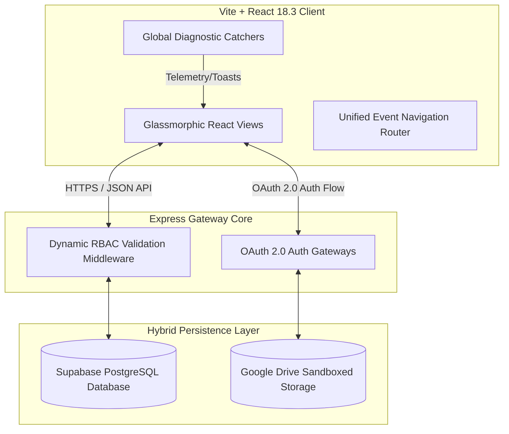

# 🛠️ MyOS Comprehensive Tech Stack & Architectural Matrix

This document provides a highly granular specification of the technologies, compilers, network layers, and runtime libraries powering **MyOS**. It serves as the primary engineering reference for modular extensions and core engine modifications.

---

## 🗺️ 1. Architecture Flow Diagram

MyOS utilizes a **Decoupled Client-Server Gateway Architecture** that bridges high-performance user interfaces with isolated relational data containers:

---

## 🎨 2. Client-Side (Frontend) Specifications

### A. Rendering Framework & Language
* **React 18.3.1**: Powered by StrictMode, concurrent rendering, and dynamic state-hooks to drive highly interactive modules.
* **TypeScript 5.x**: Leverages strict typing throughout the application context (`/src/types.ts`) for all data items, task structures, and workspace scopes.

### B. Styling, Typography & Design Tokens
* **TailwindCSS**: Provides responsive utility foundations.
* **Vanilla CSS (System Rules)**: Declared inside `/src/index.css`, implementing custom theme properties:
  - `--glass-opacity`: Dynamically bound HSL backgrounds allowing customizable glassmorphic density (from 0% to 100%).
  - `--grid-size`: Configurable workspace grid spacing presets (Dense, Medium, Wide).
  - `--accent-color`: Theme customization mapping custom user primary colors across icons, borders, and buttons dynamically.
* **Fonts**: Curated sans-serif typography paired with high-readability monospace headers for code blocks and system telemetry widgets.
* **Icons**: **Lucide React** (high-performance vector graphics rendering).

### C. Build System & Packaging
* **Vite v6.x**: Ultra-fast bundler utilizing Rollup and esbuild for sub-second hot module replacement (HMR) during development.
* **Radix UI**: Accessible primitives ensuring keyboard navigation and compliance for dialogs, cards, and tooltips.

---

## ⚡ 3. Server-Side (Backend) Gateway

### A. Server Framework
* **Node.js + Express**: Acts as a lightweight API gateway, serving static client bundles, managing session cookies, proxying Google Drive OAuth access, and validating collaboration scopes.
* **esbuild Bundler**: Builds the backend into a single production-ready CJS bundle (`dist/server.cjs`) for high performance and low startup times.

### B. Security & Scope Controller
* **Role-Based Access Control (RBAC) Middleware**: Backend-enforced interceptor verifying incoming client signatures and organization membership before committing operations on workspace tables.
* **PG-Cryptographic Hash Layer**: Secure double-entry salt encryption for user credential management.

---

## 🗄️ 4. Data Persistence & Cloud Integrations

### A. Supabase (PostgreSQL)
* Provides the primary relational repository.
* Implements robust **Row Level Security (RLS)** ensuring isolated schemas for distinct tenants.
* Supported by dynamic GIN (Generalized Inverted Index) queries over schemaless JSONB matrices.

### B. Google Drive API (v3)
* Utilized as the decentralized files database storage provider.
* Features a strict **Connection Lock Shield**: If integration is unconnected, the app blocks write/upload operations and presents glassmorphic action overlays.

---

## 🛡️ 5. Automated Resiliency & Telemetry Model

MyOS incorporates multiple fail-safes designed for mission-critical client reliability:

| Security / Telemetry Layer | Capture Target | Action Protocol |
| :--- | :--- | :--- |
| **System Error Boundary** | React rendering crashes / hook errors | Captures diagnostics stack, runs local storage tests, outputs full `.txt` report, and supports safe reboot. |
| **Window Global Interceptors** | Runtime script exceptions & network promise failures | Automatically intercepted and formatted as transient toast notifications (`myos:notification` event). |
| **Database Caching Buffer** | Offline networks / Supabase query blocks | Seamlessly captures pending entries (Notifications, Finance logs) and caches them locally inside UI state. |

---

## ⚙️ 6. Dependency Registry (`package.json` highlight)

- `@supabase/supabase-js`: Supabase integration client.
- `lucide-react`: SVG icon kit.
- `express`: REST API core server.
- `esbuild`: Production backend bundler.
- `vite`: Production frontend compiler.
